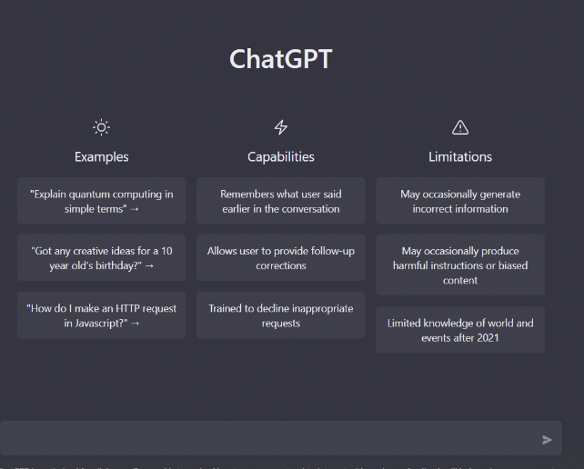

Inspired by the need for a more efficient and intelligent way to search code, we created MindFlow, the search engine powered by ChatGPT. With MindFlow, you can talk to your code like you were pinging a senior software engineer on Slack who knows everything about your project!

## What it MindFlow
MindFlow is a command-line tool and Visual Studio Code Extension for intelligent development and collaboration. It allows users to generate summaries of their work and ask questions about it, using a powerful language model (ChatGPT) to provide insightful responses. With MindFlow, developers can easily stay on top of their projects and collaborate with others more effectively.

## Features
- Query you repository and HTTP links.
    - `mf query "What is the purpose of this function?" main.py`
    - You can list any number of files, foldes, and HTTP links at the end of the command to query.
    - For queries over large amounts of files, MindFlow will will generate an index using ChatGPT, and search relevant files using the index, to use in response to your query.
        - You can view the cache for your repo in `.mf/index.json`

- Generate a summary of your `git diff`. 
    - `mf diff [args]`
    - Serves as a wrapper over `git diff` and generates a summary of its response.
    - Works for any `git diff` command.

## Setup
To install the CLI run: 
- `pip install mindflow`

**Configure your credentials:**
- Mindflow use an unofficial OpenAI ChatGPT API to generate reponses to your queries. This can be found here `https://github.com/acheong08/ChatGPT`. 
- You will need to create an account with OpenAI and have sign-in credentials for ChatGPT. Once you have these, you can run `mf configure` to set up your credentials. You can either `enter your OpenAI account email and OpenAI account password`, or you can `provide the session token` which you can get using the instructions below. 

### Getting your OpenAI ChatGPT session token
1. Navigate to `https://openai.com/` and log in. 
2. Once you are at the dashboard, either right click and select `inspect` or press `F12` to open the developer tools.
3. Navigate to the `Application` tab and and pull the value from the `secure-next-auth.session-token` cookie to enter into you session token configuration.  

## What's next for MindFlow
In the future, MindFlow plans on becoming an even more integral part of the modern developer's toolkit. We plan on adding the ability to ditch traditional documentation and instead integrate directly with your private documents and communication channels, allowing for a more seamless and intuitive experience. With MindFlow, you can have a true "stream of consciousness" with your code, making it easier than ever to stay on top of your projects and collaborate with your team. We are excited to continue pushing the boundaries of what's possible with language models and revolutionize the way developers work.

